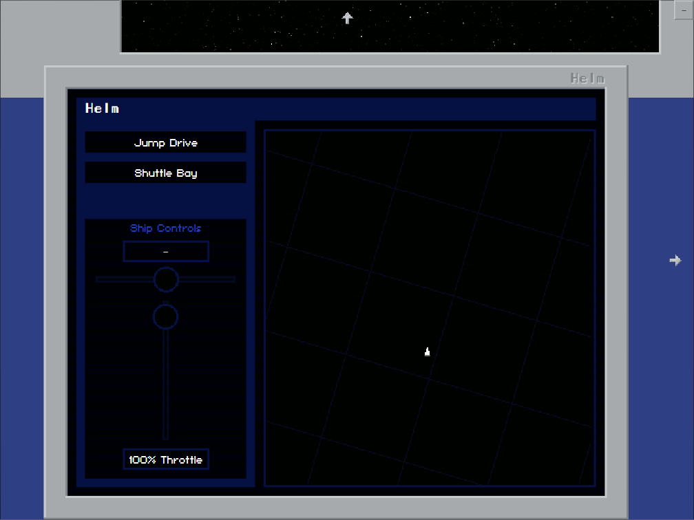

# Bob's Starship Command

This is a proof of concept for a multiplayer game in the vein of [Artemis Starship Bridge Simulator](https://www.artemisspaceshipbridge.com/).

The main differences here are that this game is implemented as a web application so it can be run on anything, and there is no 'main screen' required for all players - each player can see the viewscreen from their own device.  These differences are intended to allow people to play with each other remotely with little hassle - they only need a voice chat in something like Discord.

The current development version can be found here: https://thebobbyllama.github.io/starship-command/

